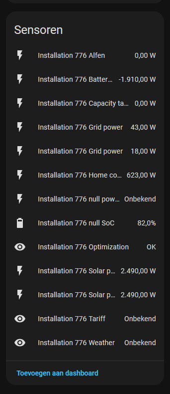
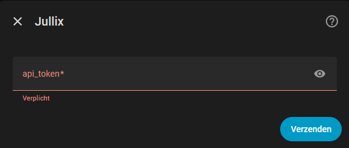

# Jullix Home Assistant Integration

[](https://github.com/hacs/integration)
[](https://www.home-assistant.io/)
[](https://buymeacoffee.com/drytrix)

A complete HACS integration for [Jullix](https://wiki.jullix.be/) (Innovoltus Energy Management System), bringing solar, battery, grid, EV chargers, and smart plugs into Home Assistant.

---

## What is Jullix?

[Jullix](https://wiki.jullix.be/) is an energy management system by Innovoltus that helps you monitor and optimize your home's energy flow—solar production, battery storage, grid import/export, and consumption. The [Mijn Jullix](https://mijn.jullix.be) portal provides real-time data and control via its Platform API.

## What This Integration Does

This integration connects Home Assistant to your Jullix installation via the cloud API (and optionally via local Jullix-Direct). You get sensors for power, energy, battery SoC, charger and plug status, plus optional switches to control chargers and plugs—all ready for dashboards, automations, and the Energy dashboard.

---

## Features

### Power & Energy

- **Real-time power data**: Grid, solar, home consumption, battery charge/discharge, capacity tariff (captar)
- **Battery monitoring**: State of charge (SoC), power per battery
- **Solar production**: Per-string and aggregate power
- **Metering**: Electricity import/export, gas consumption

### Devices

- **EV chargers**: Power and status per charger; **full control** via switch (on/off), number (max power kW), and select (mode: eco, turbo, max, block). Optional custom service `jullix.set_charger_control` for advanced control.
- **Smart plugs**: Power per plug; on/off control via switch. Installation-level **plug energy today** sensor from history API.

### Extras

- **Cost & savings**: Optional cost and savings sensors (when enabled in options)
- **Jullix-Direct**: Optional local connection for real-time data without internet
- **Algorithm & optimization**: Sensors for optimization overview; service `jullix.run_algorithm_hourly` to trigger hourly optimization
- **Tariff & weather**: Tariff and weather forecast sensors; charge session assignment via `jullix.assign_chargersession`

---

## Installation

### Via HACS (recommended)

1. Open **HACS** → **Integrations** → **Explore & Download Integrations**
2. Search for **Jullix** and install
3. Restart Home Assistant
4. Go to **Settings** → **Devices & services** → **Add integration** → **Jullix**

### Manual

1. Copy the `custom_components/jullix` folder into your Home Assistant `custom_components` directory
2. Restart Home Assistant
3. Add the integration via **Settings** → **Devices & services**

---

## Configuration

### API Token

1. Log in to [Mijn Jullix](https://mijn.jullix.be/)
2. Go to **Profiel** (Profile) → **API-tokens**
3. Create a token and copy the JWT
4. Paste the token in the integration setup

### Setup Steps

1. **API Token**: Enter your JWT from Mijn Jullix
2. **Installations**: Select which installation(s) to add
3. **Jullix-Direct (optional)**: Enter `jullix.local` or the IP of your local Jullix device for real-time data without internet. Leave empty to skip.

### Options

After setup, click **Configure** on the Jullix integration to adjust:

- **Update interval**: 30–300 seconds (default: 60)
- **Enable cost & savings sensors**: Show cost and savings data
- **Enable charger control**: Expose charger switch, max power number, and mode select
- **Enable plug control**: Allow turning smart plugs on/off
- **Prefer local Jullix-Direct**: Use local device for real-time data when configured

### Services

When the integration is loaded, these services are available under the `jullix` domain:

- **`jullix.set_charger_control`** – Set charger options: `installation_id`, `charger_mac`, and optionally `enabled`, `mode` (eco/turbo/max/block), `max_power` (kW).
- **`jullix.run_algorithm_hourly`** – Run the hourly optimization algorithm for an installation (`installation_id`).
- **`jullix.assign_chargersession`** – Assign a charge session: `installation_id`, `session_id`, and optionally `charger_mac`, `car_id`.

---

## Dashboard & Usage

### Energy Dashboard

Add Jullix power sensors (grid, solar, home, battery) to the [Energy dashboard](https://www.home-assistant.io/docs/energy/) for a complete view of your energy flow.

### Power Units

Power values are stored in **Watts (W)** for full Home Assistant compatibility (Energy dashboard, history, templates). The UI may display large values as kW depending on your locale. For a custom "X,XX kW" display, you can use a template sensor:

```yaml
template:
  - sensor:
      - name: "Jullix Solar Power kW"
        unique_id: jullix_solar_power_kw
        unit_of_measurement: "kW"
        state: "{{ (states('sensor.jullix_xxx_summary_solar') | float / 1000) | round(2) }}"
        device_class: power
```

### Example Lovelace Card

```yaml
type: entities
title: Jullix Power
entities:
  - entity: sensor.jullix_xxx_summary_grid
  - entity: sensor.jullix_xxx_summary_solar
  - entity: sensor.jullix_xxx_summary_home
  - entity: sensor.jullix_xxx_summary_battery
```

Replace `xxx` with your installation ID.

---

## Screenshots

*Replace with real screenshots when available.*

| Dashboard overview |
|--------------------|
|  |

| Integration configuration |
|----------------------------|
|  |

---

## Testing & CI

The repo includes a pytest test suite and GitHub Actions workflow:

- **Unit tests**: API client, coordinator merge, switch/sensor helpers, service handlers. CI uses lightweight deps (`requirements-test-ci.txt`); config flow and entity tests are skipped there. For the full suite including those tests locally: `pip install -r requirements-test.txt && python -m pytest tests/ -v`
- **Live API tests**: Optional smoke tests against the real API when `JULLIX_API_TOKEN` and `JULLIX_INSTALLATION_ID` are set (e.g. as GitHub Actions secrets). See [tests/README.md](tests/README.md) for details.

## Documentation

- [Jullix Wiki](https://wiki.jullix.be/doku.php?id=nl:start)
- [Integration FAQ](https://wiki.jullix.be/doku.php?id=nl:faq:integratie)
- [Platform API](https://mijn.jullix.be/apidocs/)

---

## Requirements

- Home Assistant 2024.1 or newer
- Jullix account with API token
- Internet connection (or local Jullix-Direct for real-time data)

---

## Changelog

- **1.5.2** – Docs: fix screenshot references (remove deleted energy-placeholder; README and info.md use existing screenshots only).
- **1.5.1** – Hassfest: remove invalid `icon` key from manifest; README: add repository setup (HACS description/topics) section.
- **1.5.0** – CI: use `requirements-test-ci.txt` for faster unit tests (config flow/entity tests skipped in CI); hassfest validation workflow; config flow test fix (options flow handler); REPO_SETUP.md and docs updates.
- **1.4.0** – API client: use `ThreadedResolver` for aiohttp (improved DNS compatibility); HACS brand icon; test updates.

---

## Repository setup (HACS validation)

For HACS validation to pass, set on the GitHub repository:

- **Description**: e.g. "Jullix integration for Home Assistant" (repo **About** or **Settings**).
- **Topics**: e.g. `home-assistant`, `hacs`, `integration`, `jullix` (gear icon next to **About**).

See [HACS publish docs](https://hacs.xyz/docs/publish/include#check-repository).

---

## Support

- [GitHub Issues](https://github.com/dries/HACS-Jullix/issues)
