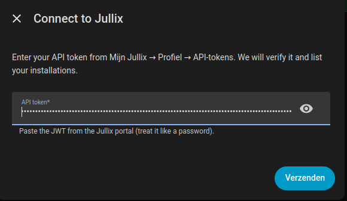
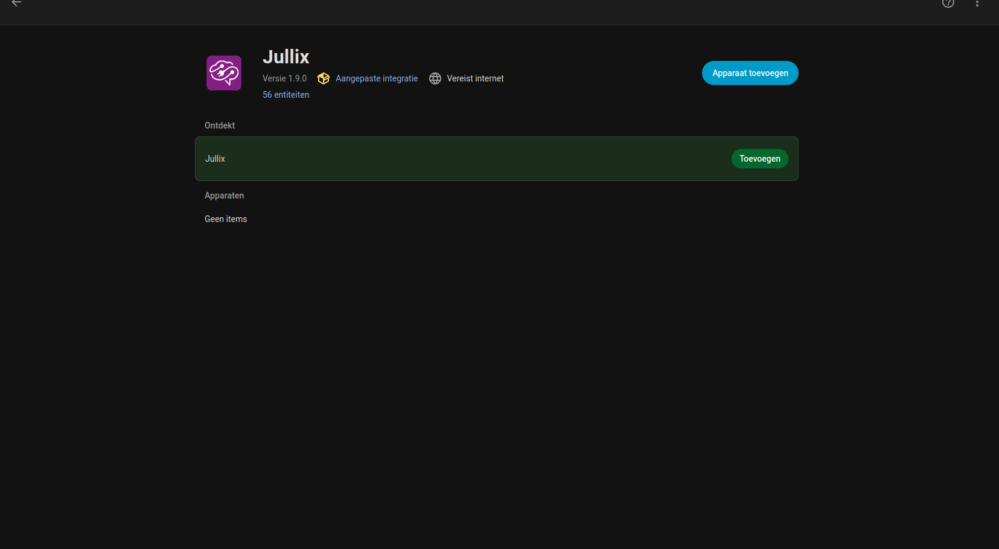
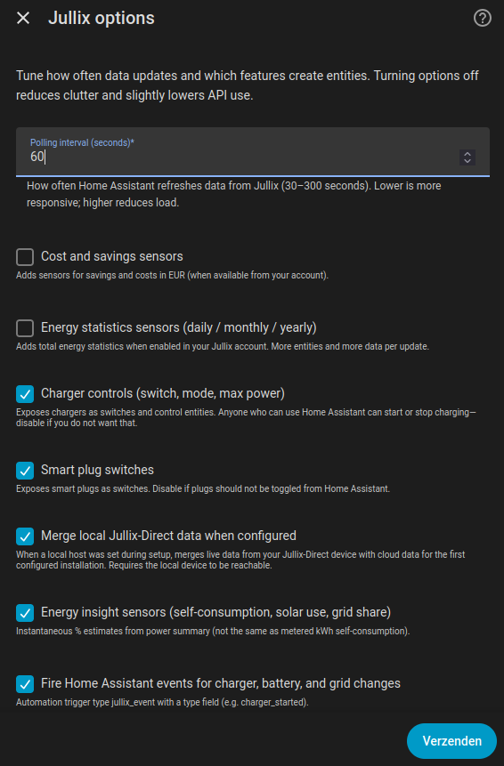

# Jullix for Home Assistant

Connect your [Jullix](https://wiki.jullix.be/) (Innovoltus) energy system to Home Assistant: live power from grid, solar, home, and battery; EV chargers and smart plugs; optional cost and tariff helpers; charger and plug control when you want it. Data comes from the [Mijn Jullix](https://mijn.jullix.be/) cloud API. If you have a Jullix gateway on the LAN, you can optionally merge **Jullix-Direct** readings for faster updates and extra meter detail.

More detail: [docs/](docs/README.md) · [Changelog](CHANGELOG.md)

## What you need

- Home Assistant **2024.1** or newer.
- A Jullix account with at least one installation.
- A Platform API **JWT** from Mijn Jullix (treat it like a password).
- Outbound internet from the Home Assistant host for cloud polling.

## Install

### HACS

1. Install [HACS](https://hacs.xyz/docs/setup/download) and restart Home Assistant.
2. Open **HACS → Integrations**, search for **Jullix**, and install.
3. Restart Home Assistant again.
4. Go to **Settings → Devices & services → Add integration → Jullix**.

If Jullix is not in your HACS catalog yet, add this repo under **⋮ → Custom repositories**: `https://github.com/DRYTRIX/Home-Assistant-Jullix` (category **Integration**), then install from **Explore & Download Repositories**.

### Manual

Copy [`custom_components/jullix`](custom_components/jullix) into `config/custom_components/`, restart Home Assistant, and add the integration from **Devices & services**.

## Setup

### API token

1. Log in to [Mijn Jullix](https://mijn.jullix.be/).
2. Open **Profiel → API-tokens** and create a token.
3. Copy the full JWT string (no spaces).

### Add the integration

1. **Settings → Devices & services → Add integration → Jullix**.
2. Paste the token. Home Assistant contacts Jullix and lists your sites.
3. Select one or more installations for this config entry.

### Jullix-Direct (optional)

On the local-host step, enter `jullix.local`, an IP address, or leave the field empty for cloud-only. Zeroconf may pre-fill a discovered `jullix*` host. The flow checks reachability; you can finish setup even if the local check fails and fix networking later.

Local data only appears in entities after you enable **Merge local Jullix-Direct data when configured** in integration options (see below). For multi-site entries, local merge applies to the **first** installation in the list.

### Options

Open **Configure** on the Jullix card to tune polling and features.

| Option | Default | Notes |
|--------|---------|-------|
| Polling interval (seconds) | 60 | Range 30–300. Lower = fresher data, more API load. |
| Cost and savings sensors | Off | Cost, savings, monthly total, hourly price helpers, peak-tariff binary. |
| Energy statistics sensors (daily / monthly / yearly) | On | Daily / monthly / yearly totals and rolling 7-day energy. Uses extended polls. |
| Charger controls (switch, mode, max power) | On | Anyone with HA access can start/stop charging—turn off if that is a concern. |
| Smart plug switches | On | On/off per plug. |
| Merge local Jullix-Direct data when configured | Off | Needs a local host from setup and a reachable gateway. |
| Energy insight sensors (self-consumption, solar use, grid share) | On | Instantaneous % estimates from power summary—not metered kWh self-consumption. |
| Fire Home Assistant events for charger, battery, and grid changes | On | `jullix_event` for automations. |
| Poll faster while charging or high grid/battery activity | Off | ~30 s while active; otherwise your interval. |
| Charge session and suggestion sensors (extra API calls) | On | Session helpers on extended polls. |
| Store short session log in Home Assistant storage | Off | Last 50 session records in HA storage. |

## Entities

Entity IDs include your installation UUID, e.g. `sensor.jullix_a1b2c3d4_e5f6_7890_abcd_ef1234567890_summary_solar` (hyphens in the UUID become underscores in the entity id).

**Find your installation ID:** open **Settings → Devices & services → Jullix → [your site]** and copy the UUID from the device page, or filter **Developer tools → States** for `jullix` and read it from any entity id.

Platforms: sensor (most data), binary sensor (peak tariff; local fault/occupancy when Direct is merged), switch / number / select (chargers and plugs), button (run optimization).

Full entity list and option gating: [docs/entities.md](docs/entities.md).

## Services and automations

Five services in the `jullix` domain (`set_charger_control`, `run_algorithm_hourly`, `force_algorithm_command`, `assign_chargersession`, `update_tariff`). Field definitions: [`services.yaml`](custom_components/jullix/services.yaml).

Events, example automations, and blueprints: [docs/automations.md](docs/automations.md).

## Energy dashboard

Map grid, solar, home, and battery sensors in [**Settings → Dashboards → Energy**](https://www.home-assistant.io/docs/energy/). For cumulative battery kWh, use **Energy charged** and **Energy discharged**.

Mapping table, template examples, and Lovelace snippets: [docs/troubleshooting.md#full-energy-dashboard-mapping](docs/troubleshooting.md#full-energy-dashboard-mapping).

## Troubleshooting

Common fixes: token rejected → new JWT via reauth; missing entities → check integration options and wait for an extended poll; local data missing → enable merge and verify the host from the HA machine; services failing → use the installation UUID from an existing entity.

Repairs may appear for bad tokens, repeated cloud failures, or unreachable local EMS. Download diagnostics from **Jullix → ⋮ → Download diagnostics** (no token in the export).

Full guide: [docs/troubleshooting.md](docs/troubleshooting.md). Dutch FAQ: [Jullix wiki](https://wiki.jullix.be/doku.php?id=nl:faq:integratie).

## Documentation

| Doc | Contents |
|-----|----------|
| [docs/README.md](docs/README.md) | Documentation index |
| [docs/entities.md](docs/entities.md) | Entity names, local EMS |
| [docs/automations.md](docs/automations.md) | Events, services, examples |
| [docs/architecture.md](docs/architecture.md) | Coordinator, API, data flow |
| [CONTRIBUTING.md](CONTRIBUTING.md) | Dev setup and PRs |

## Support

[GitHub Issues](https://github.com/DRYTRIX/Home-Assistant-Jullix/issues) · [Changelog](CHANGELOG.md)

## License

[MIT](LICENSE)
