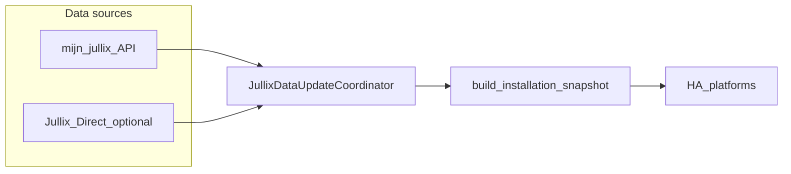

# Jullix integration architecture

This document describes how the custom component is structured and how data moves from the Jullix Platform API into Home Assistant entities.

## Overview

The integration is **cloud-first** (`iot_class: cloud_polling` in `manifest.json`). It uses a single **DataUpdateCoordinator** per config entry to poll the Platform API and optionally merge readings from a **Jullix-Direct** device on the LAN. Parsed state lives in **domain models** (`JullixInstallationSnapshot`); platforms (sensors, switches, and so on) read only from the coordinator.

## API layer

**Module:** [`custom_components/jullix/api.py`](../custom_components/jullix/api.py)

- **`JullixApiClient`** wraps HTTPS calls to `https://mijn.jullix.be` using the user’s JWT (`Authorization: Bearer …`).
- **Exceptions:** `JullixApiError` (general failures) and `JullixAuthError` (invalid or expired token). The config flow and coordinator use these for reauth and error reporting.
- **Retries:** Transient server errors (5xx) and rate limiting (429) are retried with backoff (`_MAX_ATTEMPTS`, `_BACKOFF_BASE_S`).
- **Endpoints** are centralized as `API_PATH_*` constants in [`const.py`](../custom_components/jullix/const.py).

## Coordinator

**Module:** [`custom_components/jullix/coordinator.py`](../custom_components/jullix/coordinator.py)

- **`JullixDataUpdateCoordinator`** subclasses Home Assistant’s `DataUpdateCoordinator`. Its data type is `dict[str, JullixInstallationSnapshot]` (one snapshot per configured installation ID).
- **Concurrency:** Fetches are limited with an asyncio semaphore (`_FETCH_CONCURRENCY = 4`) to avoid hammering the API.
- **Extended polling:** Not every API group runs on every refresh. “Extended” groups (cost, statistics, tariff, weather, algorithm, charger session, and related) run when [`run_extended_this_refresh`](../custom_components/jullix/features.py) is true—by default every 3rd refresh (`EXTENDED_POLL_INTERVAL`). See [Feature tiers](features.md).
- **Adaptive polling:** When enabled, the coordinator can shorten the update interval while chargers are active or grid/battery power is high (`ADAPTIVE_FAST_POLL_SECONDS`, thresholds in `const.py`).
- **Jullix-Direct:** If a local host was configured and **Merge local Jullix-Direct data** is on, the coordinator instantiates **`JullixLocalClient`** and merges local EMS data with cloud snapshots (`merge_local_snapshot`).
- **Events:** After a successful update, [`events.detect_and_fire_events`](../custom_components/jullix/events.py) compares successive snapshots and may fire **`jullix_event`** on meaningful transitions (charger start/stop, battery thresholds, grid heuristics).
- **Auth callback:** Optional `on_auth_error` can trigger reauthentication flow when the API returns auth failures.

## Models

**Package:** [`custom_components/jullix/models/`](../custom_components/jullix/models/)

| Module | Role |
|--------|------|
| `installation.py` | **`JullixInstallationSnapshot`**: normalized per-installation state entities consume. **`RawInstallFetches`**: raw JSON fragments before parsing. **`build_installation_snapshot`**, **`merge_local_snapshot`**. |
| `summary.py` | Power summary, grid/solar/home detail snapshots (`PowerSummarySnapshot`, `GridDetailSnapshot`, `SolarHomeSnapshot`). |
| `battery.py` | **`BatterySlot`** and battery detail parsing. |
| `charger.py` | **`ChargerDevice`**, charger list and control payload parsing. |
| `plug.py` | **`PlugDevice`**, plug list and plug energy parsing. |
| `costs.py` | Cost/savings and monthly total snapshots. |
| `util.py` | Shared parsing helpers. |

Entities should treat **`JullixInstallationSnapshot`** as the only structured source of truth for installation state.

## Entities (platforms)

**Entry point:** [`custom_components/jullix/__init__.py`](../custom_components/jullix/__init__.py) registers:

- `BINARY_SENSOR` (e.g. peak tariff when cost helpers are enabled)
- `SENSOR` (bulk of the integration)
- `SWITCH`, `NUMBER`, `SELECT` (chargers and plugs when control options are enabled)

**Sensors** are split by domain under [`custom_components/jullix/sensors/`](../custom_components/jullix/sensors/); [`sensors/setup.py`](../custom_components/jullix/sensors/setup.py) aggregates `create_*_entities` factories based on config entry options (cost, statistics, insights, charger session, etc.).

**Derived tariff logic** (cheap window, peak hour, `is_peak_now`) lives under [`derived/`](../custom_components/jullix/derived/) and feeds tariff-related sensors and the peak binary sensor.

**Services** are registered in `__init__.py` with voluptuous schemas; descriptions for the UI come from [`services.yaml`](../custom_components/jullix/services.yaml) and [`strings.json`](../custom_components/jullix/strings.json).

## Data flow

1. The coordinator requests cloud endpoints (and optionally local endpoints), filling **`RawInstallFetches`**.
2. **`build_installation_snapshot`** (and **`merge_local_snapshot`** if applicable) produce **`JullixInstallationSnapshot`** per installation.
3. Platforms update entities from the coordinator’s `data` on each successful refresh.

## Related reading

- [Feature tiers and polling](features.md)
- [Troubleshooting](troubleshooting.md)
- [Development guide](development.md)
