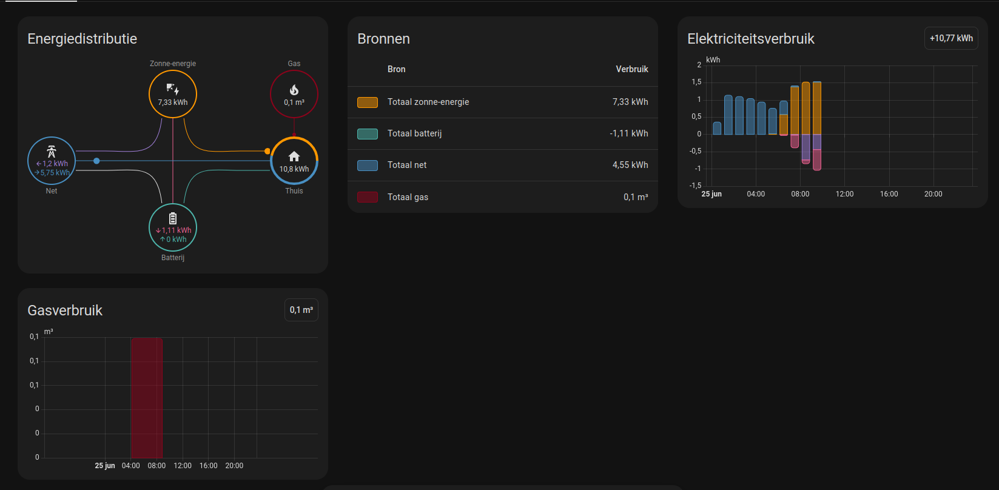

# Troubleshooting

This guide maps common problems to causes and fixes. Error strings below match the integration’s config flow translations in [`strings.json`](../custom_components/jullix/strings.json) where applicable.

## API token issues

### “The API token was rejected” (`invalid_auth`)

- Create a **new** token in [Mijn Jullix](https://mijn.jullix.be/) → **Profiel** → **API-tokens** and use **Reconfigure** / reauth when Home Assistant prompts you.
- Paste the **full** JWT with no leading or trailing spaces or line breaks.
- Confirm you are logged into the **same Jullix account** that owns the installations you expect.

### “Enter your API token” (`invalid_token`)

- The field was empty or whitespace-only. Paste a valid token from Mijn Jullix.

## Connection and API errors

### “Could not reach Jullix” (`cannot_connect`)

- Check Home Assistant host **internet** access and DNS.
- Jullix Platform API base URL is `https://mijn.jullix.be` (see [`const.py`](../custom_components/jullix/const.py)).
- If Jullix is undergoing maintenance, retry later.
- Check **Logs** for `JullixApiError` / traceback; transient **5xx** and **429** responses are retried by the client, but persistent failures surface as update failures.

### Coordinator / entity “unavailable” or log errors

- Open **Settings → System → Logs** and filter for `jullix`.
- **Auth errors** may trigger the repair / reauth flow; fix the token first.
- After repeated failures, some entities may show as unavailable until the next successful poll.

## Account and setup flow

### “This account has no installations yet” (`no_installations`)

- The token is valid but Jullix returned no installations. Complete onboarding in Jullix or use a token from an account that has at least one site.

### “Select at least one installation” (`no_installations_selected`)

- Go back one step in the config flow and select one or more installations.

### “This Jullix account is already configured” (`already_configured`)

- The same account (token) is already set up. Add another **config entry** only if you use a **different** token/account, or manage multiple installations inside the existing entry’s options where supported.

## Missing entities

1. **Open integration options** (**Configure** on the Jullix card). Many entities are gated:
   - **Cost and savings sensors** — cost, savings, monthly total, tariff helpers, peak tariff binary, automation helper sensors.
   - **Energy statistics sensors** — daily / monthly / yearly statistics entities.
   - **Charger controls** — charger switch, number, select.
   - **Smart plug switches** — plug switches.
   - **Energy insight sensors** — self-consumption / solar use / grid share style sensors.
   - **Charge session and suggestion sensors** — session-related sensors.
   - **Merge local Jullix-Direct data** — local EMS sensors (grid T1/T2, voltages, water, EV extras, local binary sensors) stay empty or unavailable until merge is on and the gateway responds.
2. **Installation selection** — entities exist only for installations selected during setup (per config entry).
3. **Reload** — after changing options, the integration reloads; wait one poll cycle.
4. **Developer Tools → States** — search `jullix` to confirm entity IDs; use **Devices** to see everything grouped by site.
5. **Optimizer and per-charger status/energy/event sensors** — these come from the **extended** poll (not every refresh; see [Extended polling](architecture.md#coordinator)) and are created only if the Jullix API actually returns data for that installation/charger. They may take a few extra poll cycles to appear, and won't appear at all if your account/charger doesn't expose that endpoint.

### Battery energy for the Energy Dashboard

- **Battery power** (instantaneous kW/W) is already exposed as **summary battery power** and per-battery **Power** sensors. These are not the same as cumulative kWh totals.
- **Energy charged** and **Energy discharged** sensors (`device_class: energy`, `state_class: total_increasing`) are created when Jullix returns cumulative `energy_charged` / `energy_discharged` fields.
- **Local Jullix-Direct:** set a local host during setup and enable **Merge local Jullix-Direct data when configured** (`use_local`). The local EMS endpoint `/api/ems/battery` supplies the cumulative totals ([Jullix integration FAQ](https://wiki.jullix.be/doku.php?id=nl:faq:integratie)).
- **Cloud-only:** the integration also fetches today's battery energy history from the platform API and backfills totals when the live battery detail payload does not include them.
- In [**Settings → Dashboards → Energy**](https://www.home-assistant.io/docs/energy/), map **Battery charged** to battery input and **Energy discharged** to battery output for your installation's battery device.

### Full Energy Dashboard mapping

Add grid, solar, home, and battery **power** sensors where appropriate. Power values from Jullix are in **watts**.



**Find your installation ID:** **Settings → Devices & services → Jullix → [your site]**, or **Developer tools → States** filtered to `jullix`. Examples below use installation `a1b2c3d4-e5f6-7890-abcd-ef1234567890` (entity ids use underscores instead of hyphens).

| Home Assistant Energy category | Jullix sensor (device) |
|-------------------------------|-------------------------|
| Grid consumption | **Grid energy import** (Grid) |
| Return to grid | **Grid energy export** (Grid) |
| Solar production | **Solar production energy** (Solar) |
| Battery input | **Energy charged** (Battery) |
| Battery output | **Energy discharged** (Battery) |
| EV charging (per charger) | **Energy total** or **Energy today** (Charger) |
| Individual devices | **Energy** (Plug), metering channels with kWh units (System) |

Some endpoints expose **today-only** totals (e.g. charger **Energy today**). Prefer sensors with `total_increasing` for long-term Energy history. Enable **Energy statistics sensors (daily / monthly / yearly)** and **Merge local Jullix-Direct data when configured** when you have a local EMS.

#### Template: solar power in kW

```yaml
template:
  - sensor:
      - name: "Jullix solar power kW"
        unique_id: jullix_solar_power_kw
        unit_of_measurement: "kW"
        state: "{{ (states('sensor.jullix_a1b2c3d4_e5f6_7890_abcd_ef1234567890_summary_solar') | float(0) / 1000) | round(2) }}"
        device_class: power
```

#### Lovelace: power summary card

```yaml
type: entities
title: Jullix power
entities:
  - entity: sensor.jullix_a1b2c3d4_e5f6_7890_abcd_ef1234567890_summary_grid
  - entity: sensor.jullix_a1b2c3d4_e5f6_7890_abcd_ef1234567890_summary_solar
  - entity: sensor.jullix_a1b2c3d4_e5f6_7890_abcd_ef1234567890_summary_home
  - entity: sensor.jullix_a1b2c3d4_e5f6_7890_abcd_ef1234567890_summary_battery
```

### Repairs (Settings → Repairs)

The integration raises repair issues when:

- The **API token** is rejected (fixable — update token via reauth).
- **Cloud updates** fail repeatedly for an installation (stale data is shown until recovery).
- **Local EMS merge** is enabled but the Jullix-Direct host is unreachable.

See also [Automations](automations.md) for `jullix_event` triggers.

## Jullix-Direct (local) issues

### “Could not reach the local Jullix device” (`local_connection_failed`)

- Confirm the hostname (e.g. `jullix.local`) or **IP** is reachable from the Home Assistant host (`ping`, browser).
- Ensure the Jullix device is on the **same network** as Home Assistant (or routed correctly).
- Firewall rules must allow the local API port used by **JullixLocalClient** (see [`local_client.py`](../custom_components/jullix/local_client.py) if you need the exact endpoints).

### Local data not appearing

- In **Configure**, enable **Merge local Jullix-Direct data when configured** (`use_local`). Without this, cloud data is used even if a local host was entered during setup.
- Local merge applies in conjunction with the coordinator’s cloud fetch; if local is down, cloud data should still update.
- For **multi-site config entries**, local EMS data is merged into the **first** installation in the list unless the entry contains only one site (then that site receives local data).

## New chargers or plugs after setup

- New hardware discovered on a later poll should appear automatically within one refresh cycle (no manual reload required). If entities are still missing, reload the integration once.

## Services fail with “No Jullix configuration includes installation_id …”

Services such as `jullix.set_charger_control` and `jullix.force_algorithm_command` require an **`installation_id`** that belongs to **this** Home Assistant setup. Use the UUID shown in the Jullix device or in **Developer Tools → States** on any `jullix` entity (entity naming includes the installation id). The integration validates the id against configured installations and raises **`ServiceValidationError`** if it does not match ([`__init__.py`](../custom_components/jullix/__init__.py)).

## Config entry diagnostics

Home Assistant can download integration diagnostics from **Settings → Devices & services → Jullix → ⋮ → Download diagnostics**. The payload includes connection mode, effective options, and coordinator health indicators (no API token). Implementation: [`async_get_config_entry_diagnostics`](../custom_components/jullix/__init__.py).

## Still stuck?

- [GitHub Issues](https://github.com/DRYTRIX/Home-Assistant-Jullix/issues)
- [Jullix integration FAQ](https://wiki.jullix.be/doku.php?id=nl:faq:integratie) (Dutch wiki)
