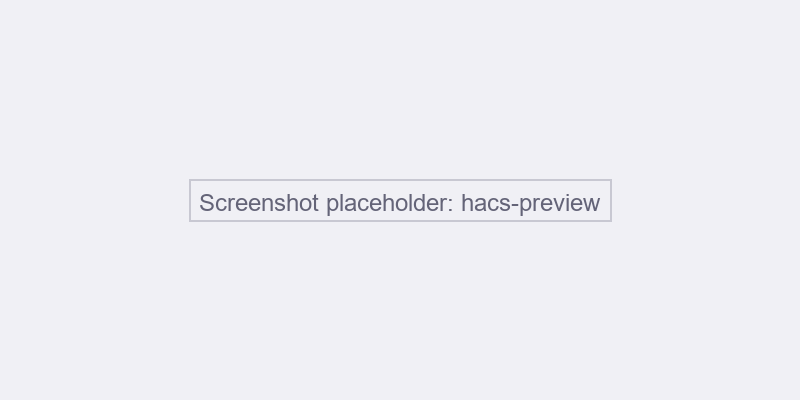

# Jullix

Integration for the [Jullix](https://wiki.jullix.be/) Energy Management System (Innovoltus). Bring solar, battery, grid, EV chargers, and smart plugs into Home Assistant with real-time power monitoring and optional device control.

## Features

- **Real-time power**: Grid, solar, home consumption, battery, capacity tariff (captar)
- **Battery**: State of charge (SoC) and power per battery
- **Metering**: Electricity import/export, gas consumption
- **EV chargers**: Status and power; optional on/off control
- **Smart plugs**: Power monitoring; optional on/off control
- **Cost & savings**: Optional cost and savings sensors
- **Jullix-Direct**: Local real-time data without internet

## Installation

1. Install via **HACS** → Integrations → Explore & Download Integrations → search for **Jullix**
2. Restart Home Assistant
3. Go to **Settings** → **Devices & services** → **Add integration** → **Jullix**
4. Enter your API token from [Mijn Jullix](https://mijn.jullix.be/) (Profiel → API-tokens) and select your installation(s)

*Replace with real screenshots when available.*

## Documentation

For full setup, configuration options, dashboard examples, and power unit details, see the [README](https://github.com/dries/HACS-Jullix).
